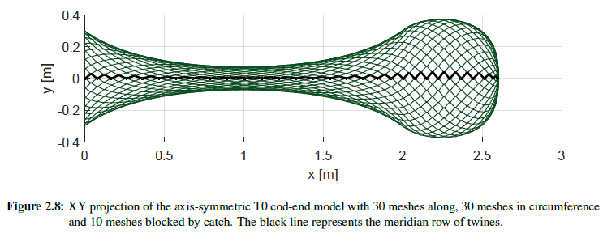
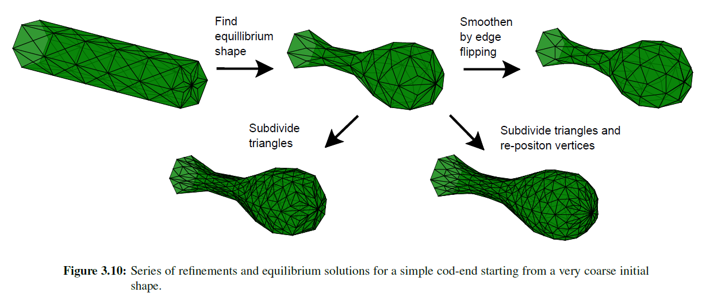
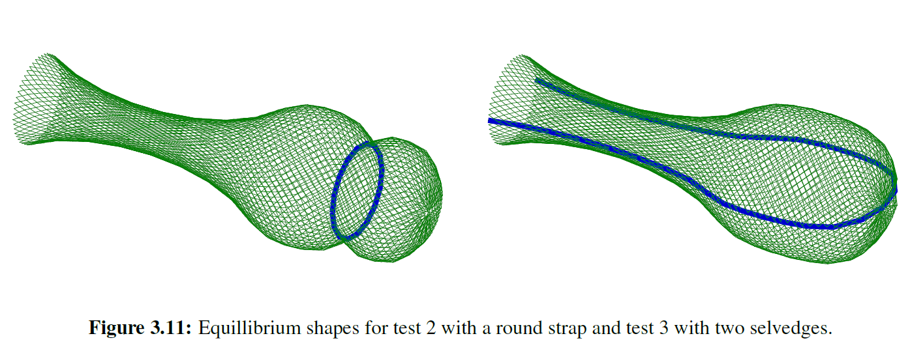
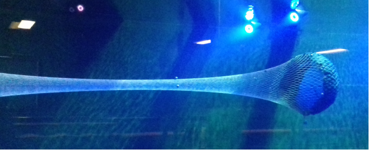
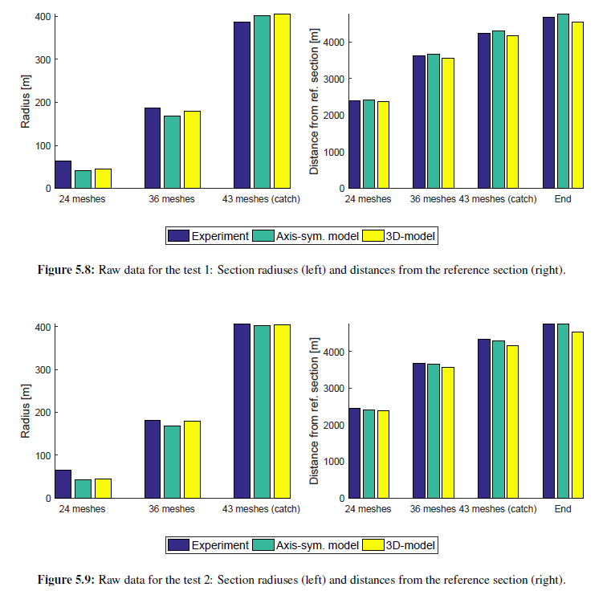

<figure>
  
</figure>

The project is a master thesis collaboration with SINTEF that resulted in a simulation tool written in C# to predict the deformation of the critical parts of the large scale fishing gear in order to assess the impact of different gear designs on by-catch reduction. The full thesis can be found [here](https://projekter.aau.dk/projekter/en/studentthesis/implementation-and-comparison-of-two-numerical-models-for-trawl-codends(7c4900a9-f83e-4f61-818b-2c271252cab1).html).
{: style="text-align: justify;"}

## Abstract
A cod-end is the rearmost part of a trawl fishing gear that
collects the catch during the towing. The shape of cod-ends
is of importance as it determines mesh opening and consequently influences the selectivity of fish from the cod-end. The project considers two different numerical models of
the cod-end deformation: the axis-symmetric model and
the 3D finite element model based on the triangular elements. The models are described and implemented in the
C# code using the principles of object-oriented programming. Different solutions for improving the convergence of
the Newton-Raphson method that is commonly used to find
the equilibrium shape of the cod-end models are presented
and compared. The numerical results from the two models
are compared. A flume tank experiment is performed with
a motion tracking system to sample the cod-end shape in
3D. The results suggests a good correspondence between the
models for the small scale cod-ends with thin twines.
{: style="text-align: justify;"}

## Axis-symmetric model
In the axis-symmetric models, the equilibrium shape of the cod-end can be obtained by considering the
equilibrium of the nodes belonging to one row of twines called meridian. All other rows of twines in the cod-end circumference will have the same shape as the meridian due to the
axis-symmetry assumption. The twines are modeled ad bar elements with linear tension stiffness and 0 compression stiffness.
 {: style="text-align: justify;"}

## 3d model
The 3d model is based on the planar triangular
elements developed by Daniel Priour. Triangular elements offer high flexibility in both geometric modeling
and numerical calculation aspects. The key difference compared to classic constant / linear strain triangles is the formulation where the element works as a super element that combines all the effects of the twines contained within it. This allows to avoid the problems typical for the models where individual physical twines are modeled by
bar elements also known as numerical twines. At the same time the stiffness of the element depends on the average deformation of the contained netting twines in 2 directions and can be 0 for the direction where the netting is in compression.
{: style="text-align: justify;"}

## Validation
The models were validated against the physical codend model carried out in the flume tank at SINTEFF OCEAN based in Hirtshals Denmark.
{: style="text-align: justify;"}

## Source code
The old source code for [axis-symetric model](https://github.com/mihsamusev/AxiCodend) and [3d model](https://github.com/mihsamusev/CodendOOP) is currently being refactored and merged into a single well tested and easy to build open cource C# library.
{: style="text-align: justify;"}